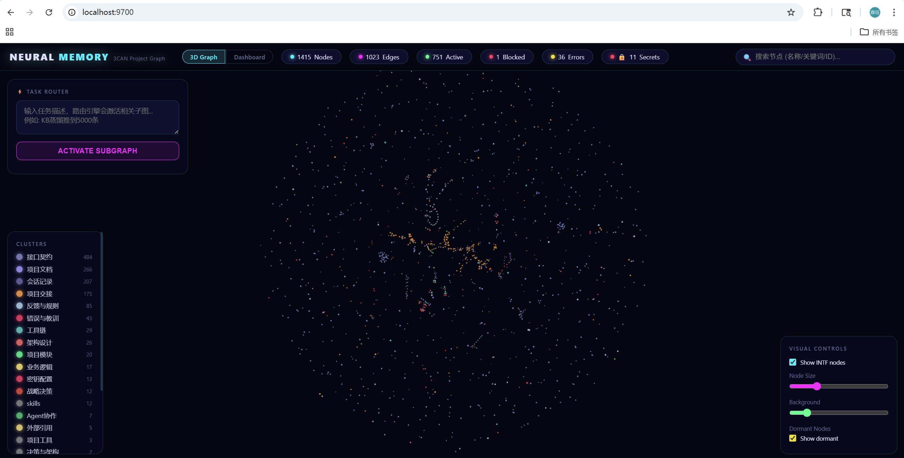

# 3CAN-engine 用户指南 (正文详版)

> 本文是 README 的**展开版**。如果你只想快速上手，先读 [README.md](../README.md) 的“非技术用户：10 分钟本地体验”。
> 本文讲**为什么用 / 怎么用 / 能力边界 / 实战案例 / 评分 / 界面 / 常见问题**.
> 版本：v0.2.0 release candidate · 语言：中文为主，技术术语保留英文原词

---

## 目录

0. [引擎就位: liveness 硬前提 (§0)](#0-引擎就位-liveness-硬前提-0)
1. [为什么要装 3CAN (问题场景)](#1-为什么要装-3can-问题场景)
2. [3CAN 和你原有工作流的关系](#2-3can-和你原有工作流的关系)
3. [可视化界面: 球体是什么](#3-可视化界面-球体是什么)
4. [核心能力清单 (按层)](#4-核心能力清单-按层)
5. [实战案例 (真实省 token 数据)](#5-实战案例-真实省-token-数据)
6. [评分与评测 (三层门槛, 不混为一谈)](#6-评分与评测-三层门槛-不混为一谈)
7. [和 agent 的对话习惯 (口语化样例)](#7-和-agent-的对话习惯-口语化样例)
8. [冷启动 LLM 审计 (花费与跳过)](#8-冷启动-llm-审计-花费与跳过)
9. [兼容说明: CLAUDE.md / memo.md / MCP / hooks](#9-兼容说明)
10. [已知能做 vs 做不了](#10-已知能做-vs-做不了)
11. [常见问题 FAQ](#11-常见问题-faq)
12. [术语表 (小白向)](#12-术语表-小白向)

---

第一次使用只需记住三件事：

1. 3CAN 是本机服务，不是必须单独打开的“主管理聊天 Session”；
2. 新用户优先使用独立项目目录、独立图谱和示例端口 `9711`；
3. 3CAN 离线时，Agent 应明确报告 `UNAVAILABLE`，但安全的本地 Git、编码、构建和离线测试仍可继续，不能伪造 route、ticket 或 writeback 成功。

## 0. 引擎就位: liveness 硬前提 (§0)

**只有当任务要依赖 3CAN 的 route、ticket、retrieve 或 writeback 时，本节才是硬前提。**

### 0.1 为什么有这一节

3CAN 引擎离线时，Agent 仍可使用当前对话、项目文件和 Git，但不能把这些来源冒充为 3CAN 的项目记忆。正确行为是把 3CAN 相关能力标为 `UNAVAILABLE`，继续安全的本地工作，只延后真正依赖 live route、ticket 或 writeback 的步骤。

典型风险: agent 仅凭当前 context 推断某组件状态，而项目图谱里已有相反
的已验证决定。Error Knowledge 的用途是保存可复用的原因、修复和验证证据，
让后续任务显式 route 后再行动。

### 0.2 怎么检测 (3 秒)

新安装、通用 seed graph 用项目级验证器:

```bash
python scripts/verify_project.py \
  --base-url http://127.0.0.1:9711 \
  --min-nodes 10
```

输出:
```
[3CAN verify] http://127.0.0.1:9711
  stats: ok=True nodes=15 min=10
  route: ok=True nodes=4 first=PROC-3can-project-bootstrap confidence=high
  result: PASS
```

通过标准:
- `/api/stats` 返 200
- `total_nodes` 达到当前项目声明的阈值 (fresh graph 默认 10)
- `/api/route` 端到端能返 ≥1 节点
- 当前进程绑定的是预期项目 graph, 不是另一个项目或空 stub

`verify_project.py` 的 `exit 0/1` 适合 CI / UAT 前置。历史
`engine_liveness.py` 固定采用成熟 dogfood 图的 1000 节点 / 500 边阈值，
不能作为 clean clone 的默认门槛。

### 0.3 什么时候会卡

- 开机后你没启引擎 (最常见)
- 你关过机但 `proxy/proxy_state.json` 存了 stale PID, 下次启动时引擎被误判为"在跑"
- backend 启了但 bind 到错端口 / 绑 0.0.0.0 和局域网其他进程冲突
- 图加载了但写回有延迟 (第一次 `/api/route` 慢到超时)

### 0.4 可选 hook 配合

`examples/claude-code-hooks/3can-behavioral-gate.js` 是可选的项目策略示例，不是 3CAN 的必要组成。启用前应先读代码并按项目风险调整；普通客户端不能借 hook 启动、停止或替换一个机器级共享运行时。离线提醒也不能阻断与 3CAN 无关的安全本地开发。

### 0.5 空图不是就位

一个常见陷阱: backend 绑到错误 CWD, `/api/stats` 返
`total_nodes=0`. HTTP 200 不代表就位。fresh graph 默认至少应有 10 个
通用 seed 节点；成熟项目应由自己的 profile 设置更高阈值。

### 0.6 半健康也不是就位

最小依赖安装会使用确定性的 hashing embedding fallback，足以完成
clean-clone 的 route/ticket/writeback 验证，但检索质量不等于完整语义栈。
如果需要 BGE / reranker 等较重语义能力，再安装 full profile。

完整语义栈安装方式：

```bash
pip install -r requirements.txt
# 或至少补齐:
pip install sentence-transformers numpy scikit-learn
```

完整就位标准应同时满足：

- `/api/stats` 返回真实节点数。
- `/api/route` 或 `/api/route/simple` 能返回相关节点。
- route ticket 能生成。
- `POST /api/nodes` 写回能完成 embedding 更新。

如果只过第一项，agent 仍然不能把 3CAN 当作项目记忆底座使用。

---

## 1. 为什么要装 3CAN (问题场景)

### 典型场景

你在写一个中等项目, 用 Claude Code / Codex / Gemini CLI 一类 AI coding agent. 开着开着你发现:

- 每个新 session 开头都要花 5-10 分钟**重新给 AI 解释**项目结构, 上次卡哪, 为什么选了方案 A 而不是 B
- 某个 bug 修完半个月后**又出现了**, AI 像没修过一样推荐同一个错误方案
- 三个 agent (主脑 Opus + Codex 前端 + Sonnet 审计) 并行工作, **互相不知道对方做了什么**, 频繁重复劳动
- `CLAUDE.md` / `memo.md` / `handoffs/active/*.md` 越堆越多, 每 session 注入 **1-2 万 token** 都是固定开销
- 让 AI `grep memory/` 查历史, 一次要读 5 个 markdown 文件, 每次 **3-5K tokens** 烧掉但又不得不查

3CAN 针对的就是这几个痛点. 不是万能药, 不是替你写代码, **是帮你和 AI 一起维护一份"项目知识底座"**.

### 不适用场景 (别硬上)

- 你只是想 AI 记住你个人兴趣爱好 (3CAN 不管这个, 用 Mem0 之类的通用记忆工具更合适)
- 你要零代码拖拽 AI 流程 (用 n8n / LangFlow)
- 你要企业级权限和多租户 (v0.1 没有)
- 你项目才几十行代码 (不值得, 直接 CLAUDE.md 一文件就够)

---

## 2. 3CAN 和你原有工作流的关系

**加一层, 不替换**:

```
  你的 AI agent (Claude Code / Codex / ...)
      │
      ├── 读 CLAUDE.md   ← 继续用, 全局规则
      ├── 读 memo.md      ← 继续用, 或者被扫进 3CAN 图谱
      ├── 用 MCP servers  ← 继续用, 不冲突 (3CAN 不是 MCP)
      ├── 用原有 hooks    ← 继续用, 3CAN 的 hooks 独立并存
      │
      └── 新增: 访问 3CAN (localhost:9700)   ← 按需查项目图谱
                │
                └── 返回: 决策 / 会话 / 错误 / 接口契约 专类节点
```

### 真实 token 对比

如果你现在是这样 (未装 3CAN):

```
[session 开始, 固定注入]
CLAUDE.md          ~2000 tokens
memo.md            ~3000 tokens
handoffs/active/*  ~5000-8000 tokens
────────────────────────────
合计固定开销       10,000-13,000 tokens / session

[session 中间, 每次查历史]
agent 被问 "上次 X 怎么修的" → grep memory/
grep 回来 5 个 markdown 文件, 每个 500-1000 行
────────────────────────────
单次查询消耗       3000-5000 tokens
```

装了 3CAN 后:

```
[session 开始]
GET /api/briefing         ~2000 tokens (浓缩版: active agents / recent ERR / recent INTF / project state)
────────────────────────────
省掉 8000-11,000 tokens / session

[session 中间]
POST /api/route           ~300-500 tokens (slim mode 返 top-5 节点摘要)
需要展开 → /api/retrieve  ~500-800 tokens (full 单节点)
────────────────────────────
单次查询消耗       300-1300 tokens, 对比 grep 3000-5000, 省 70-85%
```

**2.5 个月 dogfood 单用户观察**: input token 占用**降低约 30-40%**. 这是主观估算, 不是跨工具 benchmark.

---

## 3. 可视化界面: 球体是什么

打开 **http://localhost:9700/** 看到:



**怎么读这个球**:
- **每个点 = 一个节点**. 颜色按 cluster (项目模块 / 接口契约 / 错误教训 / 会话记录 等) 区分
- **每条线 = 节点间的关系**（14 类；基础依赖/信息关系，以及 v0.2 的错误分组、解决、证据验证、适用、取代和复发关系）
- **点越大 = 被 route 命中次数越多** (activation_count)
- **点越亮 = 优先级越高** (critical > high > medium > low)
- **孤立的点 = 长时间没被用到的 dormant 节点** (按生命周期会自动降级)

**你可以干什么**:
- 左键拖拽旋转球体, 滚轮缩放
- 点节点看它的全文内容 + 邻居节点
- 搜索框输关键词跳到相关节点
- 筛选节点类型 / 时间范围

对开发者最有价值的不是"好看", 是**通过社区结构 (Leiden 聚类) 看你项目的知识板块**. 如果某个板块的节点挤在球的一边, 另一块稀疏, 通常意味着那部分**还没积累够**.

---

## 4. 核心能力清单 (按层)

按 [BENCHMARK_POLICY.md](./specs/3CAN_ENGINE/BENCHMARK_POLICY.md) 的三层划分:

### 第一层: 记忆 / 检索 (Memory / Retrieval)

| 能力 | 说明 |
|---|---|
| 图谱检索 | 4-signal RRF (embedding + 关键词 + IDF + 短代码索引) + cross-encoder rerank, 20 token 一个 skeleton / 50 slim / 500 full 三档可选 |
| 中英混合 | BGE-M3 多语言, 中英混写原生支持 |
| 预算硬限 | `budget_tokens=500` 你告诉引擎这次查最多花 500 tokens, 返回会自动裁 |
| 置信度标签 | 每次查询返 high/medium/low, 低置信时 agent 应 fallback 调 skill 或 WebSearch |

### 第二层: 项目 substrate

| 能力 | 说明 |
|---|---|
| 9 类节点 | knowledge / feedback / session / decision / process / tool / reference / secret / skill |
| 20+ 前缀 | DEC (决策) / SES (会话) / ERR (错误) / INTF (接口契约) / FEE (反馈规则) / MOD (模块) / 等 |
| 多 agent 注册 | 每个 agent checkin, 互相看到对方在做啥 |
| INTF 契约节点 | 改 API 前先查 INTF, 避免前后端不一致 (Codex 写前端特别有用) |
| 生命周期自动衰减 | 30 天没被 route 命中 → dormant, 60 天 → archive, 命中自动复活 |
| 活动日志 | 每次写入 hash-chain 串起来, `/api/audit/verify` 验完整性 |

### 第三层: Harness / 治理 (可选)

| 能力 | 说明 |
|---|---|
| Route Ticket Gate | 动手前必须先 route 拿 ticket, ticket 包含相关 ERR / INTF / API_USAGE 提醒, agent 必读 |
| PostToolUse 强制写回 | 改完文件自动写进 activity_log, 失败落 `~/.claude/logs/3can-writeback-fail.jsonl` |
| 内容审查 Stage 2 | LLM 读 agent 即将写的内容, 判 4 类问题 (数据时效 / 推脱归因 / 作弊提议 / 未查 ERR) |
| Sentinel bootstrap | 紧急 bypass 机制, 文档化在 DEPLOYMENT.md §1.7 |
| 全审计 | 所有 gate 决策写 `~/.claude/logs/3can-gate.jsonl`, 可追溯 |

### 第四层: LLM 多角色 (BYOK, 每点可关, 可自由调配)

LLM 接入地图详见 `LLM_POLICY.md`: retrieval models / tokenizer budget / generative LLM tools 三层分离. Route 核心不依赖 generative LLM; 项目冷启动、关键词/别名修复、摘要补全、节点健康、边建议、内容 gate 和 benchmark judge 属于 BYOK 或本地模型增强点, 必须按 `shipped / partial / planned` 标注.

**默认 provider**: DeepSeek-V3.2 (作者 dogfood 用的, 性价比高, 中英文友好). 你随时可切:

| Provider | 适合场景 | 成本档位 |
|---|---|---|
| **DeepSeek-V3.2** | **默认, 中英混合项目** | ~$0.14/M in, $0.28/M out (超低) |
| OpenAI GPT-4o / GPT-5.4 | 需要高精度判官 (behavioral gate) | ~$2.5/M in (10x DeepSeek) |
| Anthropic Haiku 4.5 | 轻量 gate + 快速 tool judgment | 中等 |
| Qwen3-Embedding / 本地 llama.cpp | 敏感项目 (完全离线) | $0 + 你的显卡电费 |
| Nomic-embed / 其他 OpenAI-compat | 你喜欢的任意 | 按 provider |

**怎么切**: 跟你的 agent 说"接下来用 DeepSeek 跑 kw 校准, 判官用 GPT-4o", agent 读 `~/.claude/secrets.json` 对应的 key 后按角色走不同 provider. **不需要改 3CAN 代码**, 配置级解决.

**每个点可关**: 预算紧时关掉非关键 LLM 工具. 引擎核心 (route / 写入 / 审计) 完全不依赖 generative LLM, 只靠本地 encoder (BGE-M3), 全关了照样工作.

### 第五层 (隐式): 工程纪律 / harness engineering

3CAN 的可选 Harness 层只收敛**可验证的进展**：Codex 原生 Hook 可以在上下文压缩后重新注入当前目标与验收条件，在停止前检查一份与当前 Git/Worktree 绑定的本地证据收据。它不管理模型的思考，不解析 Session JSONL，也不要求每次编辑、测试或提交都访问 3CAN。

**我们不把这个当身份标签**, 不标榜"harness-first" 或"next-gen platform". 只说: 如果你关心工程层面让 agent **更可控、更可审计、更少重复错误**, 3CAN 的这些机制对齐主流趋势.

这一层可以**完全关掉** (不装 hooks), 3CAN 就退回单纯的记忆 + 检索服务。启用时也只应选择项目真正需要的 bounded hook；日常开发仍然是理解、编辑、测试和 Git 检查点。完整契约见 `docs/CODEX_CONVERGENCE_HOOK.md`。

---

## 5. 使用示例与历史 dogfood 估算

本节数字来自早期单用户 dogfood 估算，未附冻结输入、tokenizer 和原始
receipt，不能作为 v0.2 性能保证。示例用于解释工作流，不是验收结果。

### 案例 1: 查 ERR 历史先例 — route vs grep

**场景**: agent 即将修一个 bug, 需要查"我们以前是不是踩过类似坑". 决定性一步, 不能漏.

**用 grep 的成本**:
```
grep -r "bug" memory/ handoffs/active/
→ 返回 5-8 个匹配文件, 每个文件 500-1200 行 markdown
→ agent 需要读完整文件才能判断是不是相关 (grep 只返行)
→ 平均 consumption: 3000-5000 tokens
→ 如果查了 grep 后仍要看 handoff 原文上下文, 总计 5000-8000 tokens
```

**用 3CAN route 的成本**:
```bash
POST /api/route {"task": "bug 历史 先例", "max_nodes": 5, "mode": "slim"}
→ 返 5 个最相关 ERR-* 节点, 每个 ~50 tokens (含 id + name + summary + current_state)
→ 总返回 ~250-300 tokens
→ 如果某个节点特别相关, 单独展开: GET /api/retrieve/{id} → ~500-800 tokens
→ 平均 consumption: 300-1000 tokens
```

早期单次估算记录了 70–85% 的上下文缩减，但没有可复现票据。实际差异
取决于图谱质量、pack mode、tokenizer 和候选文档规模。route 返回排序后的
候选；是否比 grep 更准确仍需在冻结任务集上验证。

### 案例 2: 新 session 冷启动 — briefing vs 固定注入

**不装 3CAN**:
每次新 session 开始, `CLAUDE.md` + `memo.md` + `handoffs/active/*` 都被固定注入. 固定开销 ~12,000 tokens.

**装了 3CAN**:
```bash
GET /api/briefing
```
返回:
- `agents_active`: 最近活跃 5 个 agent + 各自当前任务
- `recent_activity`: 最近 5 条 activity log
- `err_warnings_7d`: 过去 7 天新增的 ERR top-3
- `project_state`: 节点总数 / 边数 / cluster 分布

早期 dogfood 估算约 2,000 tokens；它说明 briefing 可以限制载荷，但不是
v0.2 的固定消耗或节省比例。

### 案例 3: 修改 API → INTF 节点锚定

**场景**: 你改了后端 `schemas.py` 的 `NodeCreate` 字段, Codex 在写前端表单.

**不用 INTF**: Codex 不知道 schema 改了, 它凭记忆生成字段, 结果**和后端错位**, 前端跑一下报 422.

**用 INTF**:
- 后端改完, Claude Code 的 PostToolUse hook 自动 `/api/activity/log`, 并**提示**作者 "schemas.py 改了, 要不要同步更新 INTF-schemas-NodeCreate 节点".
- 作者说 "是的, 更新", agent 调 `PUT /api/nodes/INTF-schemas-NodeCreate`, 图谱里 INTF 节点和最新 schema 对齐.
- 后续 agent 写前端前，先
  `POST /api/route {"task": "NodeCreate schema"}`，读取最新 INTF，再按
  实际 schema 验证字段。

这是推荐流程；是否减少返工需要项目自己的 UAT 记录证明。

---

## 6. 评分与评测 (三层门槛, 不混为一谈)

我们**不发布单一综合分**. 按 [BENCHMARK_POLICY.md](./specs/3CAN_ENGINE/BENCHMARK_POLICY.md) 三层并列:

| 层 | 当前证据 | 后续验收门槛 | 状态 |
|---|---|---|---|
| **L1 Memory / Retrieval** | 2026-04-15 历史内部记录 MRR 0.9239；发布包缺冻结图谱/原始票据且 fixture 已漂移 | ≥ 0.75 on a reproducible public benchmark | ⚪ v0.2 未重跑 |
| **L2 Project Substrate** | 当前 [synthetic_public seed receipt](./evidence/SEED_GRAPH_BENCHMARK_20260809.json) 记录 10 cases、top1 1.0、mean top3 recall 0.8167；仅限 development fixture，不证明私有图或真实协作 | ≥ 0.80 on a frozen 20+ case suite | 🟡 PARTIAL：synthetic candidate only |
| **L3 Harness / Governance** | 历史 denial-biased pilot 记过 8/8，但缺 valid-ticket allow 路径与原始票据 | 覆盖有效票据 allow、拒绝路径和生产触发证据 | ⚪ v0.2 未验收 |
| **Real UAT** | recorder ready；发布包无当前 v0.2 receipt | ≥ 5 个冻结、可审计场景 | ⚪ 未验收 |
| **No critical regression** | 以本候选当次 CI/测试票据为准 | 全部必需门槛通过 | ⚪ 发布前待确认 |

**v0.2 候选状态**: active prototype / experimental developer preview,
**尚未发布，也不是 release-ready**。历史 L1 分数不算 v0.2 当前验收；v0.2 需要在可发布、
冻结且带原始票据的 fixture 上重新建立 L1/L2/L3/UAT 证据。

### 坦诚说明: 业内对比

- 历史 LongMemEval 记录缺少随包发布的冻结输入、环境和原始 receipt，
  不能作为当前 v0.2 分数。
- **我们不做**“3CAN 比 X 强”的跨工具对比声明。不同工具优化方向不同，
  且没有完成 apples-to-apples 复测。

---

## 7. 和 agent 的对话习惯 (口语化样例)

**不用记 API 端点**. 你说人话, agent 听懂后走背后的 HTTP 调用。下面
使用通用、synthetic 的对话示例:

### 开 session 时

```
你: "先看看咱俩上次聊到哪了"
agent: (内部调 /api/briefing)
       "上次在修导入器的字段映射，还缺一个回归测试。
        有一条相关 ErrorCase 已含验证过的解决方案，要展开吗?"
```

### 查历史决定 / 错误

```
你: "之前为什么选择云端渲染，不用本地渲染?"
agent: (内部调 /api/route)
       "有一个 DEC-render-pipeline 节点，记录了当时的兼容性测试、
        成本边界和审批条件。"

你: "上次那个代理路由错误是怎么修的?"
agent: (内部调 /api/route 查 ERR-*)
       "对应 ErrorCase 已记录根因、修复步骤和通过的回归测试。"
```

### 做完一个决定 / 修完一个坑 — 让 agent 沉淀

```
你: "我们刚决定整个 benchmark 改成三层评分, 把这个记一下"
agent: (内部调 POST /api/nodes 建 DEC-*)
       "已建节点 DEC-benchmark-3-layer-..., 关键词 '三层评分 substrate harness memory 门槛制'"

你: "这个坑以后别再犯了, 沉淀一下"
agent: (内部调 POST /api/nodes 建 ERR-*)
       "已建 ERR-..., current_state 写了 '避免方式'. 以后相关操作前会 route 到它."
```

### 想直接操作引擎

```
你: "写回引擎, 本 session 关键决定"
agent: 走 /api/writeback 批量更新当前 session 的 SES-* 节点 current_state

你: "节点图谱健康吗?"
agent: 调 /api/health/scan + /api/audit/verify, 返回孤立率 / 零激活率 / hash 链完整性
```

### 进阶 (当 agent 自己开始熟练 3CAN)

一段时间后, **agent 会自发地**在你没明说的情况下 route / writeback:
- 你说"改 schemas.py 加个字段", agent 先自动 route 相关 INTF 节点看现状, 改完后自动 update INTF
- 你问一个一年前的决定, agent 先 route 再答, 不再凭 context 猜
- 你问“上次 benchmark 使用哪个 fixture”，agent 先 route 到对应
  Session 与 ErrorCase，再基于冻结 receipt 回答

**这才是 3CAN 的完全态**: 你和 agent 的正常对话, 背后是结构化的图谱积累.

---

## 8. 冷启动 LLM 审计 (花费与跳过)

### 路径 A: 让 LLM 帮你全盘审计 (推荐但有成本)

装完 3CAN 后, 跑:
```bash
python neural-memory/tools/project_bootstrapper.py --project-dir .
```

这会调 LLM 扫你项目的:
- 代码文件 (抽 INTF 契约 / 模块结构)
- `CLAUDE.md` / `memo.md` / `handoffs/*.md` (抽决策 / 错误 / 会话)
- `git log` (抽 fix: / bug: commit 类 → ERR)
- `schemas.py` / API 路由定义 (抽 INTF)

生成 20-80 个种子节点, 每节点带 L2 摘要 + 关键词. 图谱一下子就"有东西"了.

**典型成本**:
- 小项目 (10 Python 文件 + 3 份 markdown): **$0.03-0.10** (用 DeepSeek) / $0.3-1.0 (GPT-4o)
- 中型项目 (50 Python 文件 + 10 份 markdown + handoffs): **$0.10-0.50** / $1-5
- 大项目 (200+ 文件): **$0.50-2.00** / $5-20

一次性投入. 以后增量更新是按变更扫描, 每月 $0.01-0.10 级别.

### 路径 B: 跳过 LLM 审计, 按需逐步建

如果:
- 预算紧
- 想完全控制哪些进图谱
- 小项目不值得全盘审

直接用. 每次 agent 完成阶段性决定, 用自然语言让它写回 (案例 5.3). 图谱从 0 自然长. 典型 2-4 周会长到有用的规模.

### 混合策略

实际大多数人走**混合路径**:
- 第一天跑一次 path A, 成本 <$0.20, 图谱初始有 20-50 节点
- 之后按 path B 自然增长
- 每 1-2 月跑一次 `bootstrapper --incremental` 补扫新代码 / 新决定

### 隐私说明

`project_bootstrapper` 会把**代码片段和文档内容发给你配置的 LLM provider**. 敏感项目请:
- 用本地 `llama.cpp` provider (不出本机)
- 或完全跳过 path A, 只手动建节点

详见 `docs/specs/3CAN_ENGINE/LLM_POLICY.md §5`.

---

## 9. 兼容说明

### CLAUDE.md / memo.md / 其他 markdown

**继续用, 不冲突**.

如果你的 `memo.md` 或 `handoffs/active/*.md` 内容已经积累了很多, 让 agent 帮你把**其中结构化的决定 / 错误 / 接口**导入 3CAN 作种子节点:

```
你: "把 handoffs/active/ 里的 decisions 都扫进 3CAN"
agent: 跑 project_bootstrapper 针对性扫 handoffs 目录 → 建 DEC-* / SES-* 节点
```

扫完后, 你可以**继续保留** markdown 文件 (作人类可读索引), 也可以删 (figure 靠 3CAN 图谱查). 两种都 work.

### MCP servers

3CAN 本身**不是 MCP**. 但它不排斥 MCP — 两者用例不重叠, 可并存.

如果你装了很多 MCP (filesystem / github / gmail / ...), 每个 MCP 的 tool 定义都会注入 agent 的 system prompt. 这部分开销 3CAN 帮不了你 — 不在 3CAN 职责范围. 但你可以让 agent 按需开关 MCP (参考我们 `.claude/rules/01-core.md` 的 MCP 治理段), 这和 3CAN 无关.

### 已有的 Claude Code hooks

不冲突。`examples/claude-code-hooks/` 和 Codex Project Kit 的 Hook 都是可选适配器。只启用能够说明明确风险、输入和退出条件的 Hook；不要为了“完整”把所有门禁叠加到开发热路径。不装 Hook 时 3CAN 引擎仍可正常提供记忆与检索。

### 已有 `.claude/rules/*.md`

完全正交. 那是你给 agent 的全局规则, 3CAN 只管知识图谱的存取. 在你的 rules 里加一段"新 session 先 briefing" 就够.

---

## 10. 已知能做 vs 做不了

### 能做 (v0.1 已实现)

- ✅ 跨 session 记忆查询接口与路由实现
- ✅ 多 agent 注册 + 事件日志 + hash chain 审计
- ✅ INTF 契约节点 + DEC/SES/ERR/FEE 专类分层
- ✅ 生命周期衰减 + 复活
- ✅ 可选 PreToolUse Route Ticket Gate + PostToolUse writeback
- ✅ LLM 多角色增强地图 (BYOK; 具体 shipped / partial / planned 以 LLM_POLICY.md 为准)
- ✅ 蓝绿热部署
- ✅ 纯 HTTP, 任意 agent 可接 (不绑 Claude / OpenAI)
- ✅ 中英混合原生

### 做不了 (v0.1 已知缺口)

- ❌ **bi-temporal validity** (事实有效期, 比如 "以前说 Ka 用 RTX 4090, 后来换 RTX 5090, 现在问用啥 GPU"). v0.2 目标.
- ❌ **跨项目能力共享** (不做 agent 能力市场)
- ❌ **自动 agent 编排** (3CAN 不跑任务, agent 自己跑)
- ❌ **企业 RBAC / 多租户**
- ❌ **10K+ 节点扩展性** (当前 numpy 矩阵到瓶颈, 需 pgvector / HNSW, v0.2+)
- ❌ **真实 UAT 统计数据** (recorder ready, 但用户实际使用数据要 3-6 月累积)

详见 [LIMITATIONS.md](./specs/3CAN_ENGINE/LIMITATIONS.md).

---

## 11. 常见问题 FAQ

### Q1. 我要装多少依赖?

- Python ≥ 3.11 (必)
- `requirements-min.txt`：FastAPI、uvicorn、Pydantic 等最小本地运行依赖
- `requirements-full.txt`：可选语义栈入口；模型缓存和额外依赖由你自己的环境管理
- BGE-M3、reranker、`leidenalg` / `python-igraph` 等均不是第一次验证安装的硬要求

最小 hashing 配置体积较小；完整模型的磁盘和内存占用取决于你选择的模型、缓存与图谱规模，发布包不承诺固定数值。

### Q2. 每次启动要多久?

- 最小 hashing + fresh seed graph 通常适合快速安装验证；
- 完整语义模型的首次下载、节点编码和深度校验可能明显更久；
- 启动时间受 CPU、磁盘、模型缓存和节点数影响，应以本机 `/api/stats?deep=true` 与日志为准，不使用未经本机测量的固定承诺。

### Q3. 必须联网吗?

- **BGE-M3 加载**: 第一次装要联网下载模型. 之后可离线.
- **LLM 工具 (BYOK)**: 如果你用 DeepSeek / OpenAI / Anthropic API, 那些调用要联网. 本地 `llama.cpp` 可以完全离线.
- **引擎本体 (route/写入/查询)**: 完全离线.

### Q4. 我公司不让传代码给外部 LLM

用本地 `llama.cpp`. 配置见 `LLM_POLICY.md §2.1`. 或完全不用 LLM 工具 (跳过 path A 冷启动), 手动建节点.

### Q5. 3CAN 会改我的源代码吗?

**不会**. 3CAN 是记忆 + 查询服务, 它只**读**你的文件 (通过 bootstrapper 或 agent 主动 read). **不写**源代码. 你的 agent (Claude Code / Codex) 才写代码, 3CAN 只给 agent 提供上下文.

### Q6. 图谱数据存哪? 会上传吗?

- 本地存 `graph/nodes/*.json` + `graph/edges.json` + `graph/embeddings.npz`
- **绝不上传**. 3CAN 不联网回传数据.
- 你自己要 commit 图谱到 git 完全可以, 但**默认 `.gitignore` 排除**, 避免误 commit (因为图谱可能含敏感信息).

### Q7. 能多人共享一个图谱吗?

v0.2 支持多个 Agent/Session 并发连接同一个明确管理的本地实例，并以 Agent、项目、命名空间、Worktree/Workspace 和需要时的 ticket/digest 绑定写入。图引擎对共享状态使用一致性边界，受保护节点支持版本冲突拒绝，而不是无条件覆盖。

但本版本仍没有内建多租户认证和企业权限系统：不要把它直接暴露到局域网或公网。跨用户部署应增加认证、TLS、网络隔离与独立安全审计。

### Q8. 我不会写 Python 怎么办?

不需要自己写 Python。按 README 的 PowerShell 或 Bash 命令安装、初始化和验证即可，也可以让 Codex、Claude Code 等 Agent 读取 `docs/PROJECT_KIT.md` 后协助接入。任何删除、联网公开、付费调用或生产变更仍应由你明确确认。

### Q9. Windows 能跑吗?

能。推荐 Windows 11 + Python 3.11 或更高版本，并直接使用 README 的 PowerShell 虚拟环境与 `scripts/init-project.ps1`。如果选择 Bash 路径，再使用 Git Bash 或 WSL；不要在 PowerShell 中假设系统一定装有 Bash。

### Q10. 可以不用你的 hooks 吗?

完全可以。Hooks 是可选的收敛/硬化层，不是 3CAN 运行前提。普通开发不要求每个 Prompt、工具、测试或 Commit 调用 3CAN；有意义的模块收尾才可使用 `AUTO_CLOSEOUT`，用户明确要求时使用 `OWNER_REQUESTED`。3CAN 不可用时如实报告 `UNAVAILABLE`，不阻断安全的本地开发。

Codex Project Kit 还提供一个不联网的原生收敛 Hook：它在压缩后恢复小型目标契约，并用当前 Git/Worktree 收据区分 `CANDIDATE_READY` 与真正的用户接受。启用、信任和全局推广都应由用户单独 review。

### Q11. 是否必须单独开一个 3CAN 管理 Session?

不需要。3CAN 是进程和 API，不是聊天角色。普通项目可以运行自己的 sidecar；机器级共享实例可以交给操作系统服务管理器或一个明确的 Supervisor。各 Coding Agent 只需配置同一个 `THREECAN_BASE_URL` 并携带自己的项目/工作区身份。

---

## 12. 术语表 (小白向)

| 词 | 人话 |
|---|---|
| substrate | 底座. 3CAN 是 "给 agent 共享项目知识的底座", 不是做记忆的工具 |
| harness | 运行时约束. 比如"动手前必须先查 ERR", 这是 harness. hook 是 harness 的一种实现 |
| BYOK | Bring Your Own Key, 自备 API key. 3CAN 不替你付费, 你用哪个 LLM 自己给 key |
| INTF | interface 的缩写. 3CAN 里特指接口契约节点 (API schema / 函数签名 / DB 表结构) |
| ERR / DEC / SES / FEE | 节点前缀. ERR=错误教训 / DEC=决策 / SES=会话 / FEE=反馈规则 |
| briefing | 冷启动摘要. 一次调用拿全局状态, 替代读一堆 markdown |
| route | 查. `POST /api/route` 相当于"跟图谱说: 帮我找相关的前 5 个节点" |
| writeback | 写回. `POST /api/writeback` 或 `POST /api/nodes` 相当于"把这个信息存进图谱" |
| hash chain | 哈希链. 每条活动日志带 SHA-256, 串在一起, 可验证没被篡改 |
| Leiden | 社区发现算法. 自动把节点按关联紧密度分组 |
| RRF | Reciprocal Rank Fusion. 把多个排序结果融合的算法 (Cormack 2009, 标准) |
| dogfood | 自己用自己产品. 作者用 3CAN 开发 3CAN 本身, 2.5 月 |
| vibecoding | 非传统编程出身, 靠直觉 + AI agent 写代码. 作者自称 |
| OPC | One-Person Company. 一人公司, 独立开发者 |

---

## 一句话收束

3CAN 不是革命性技术, 不追 SOTA. 它是一个**合理组合**: 把 BGE-M3 检索 + 图谱结构 + LLM 校准 + harness gate + agent 协同这几块拼在一起, 针对中型项目 + 小团队 + 多 agent 场景做**工程层面**的优化.

**你花 1-3 天上手, 之后持续省 30-40% input token**, 这大约是你能从 3CAN 获得的回报.

如果这符合你的需求, 欢迎试. 有问题请 issue, 有代码改进请 PR. 有严厉批评尤其欢迎.

---

*本 USER_GUIDE 是 README 的展开版. 技术细节见各 `docs/specs/3CAN_ENGINE/*.md`. 许可问题见根目录 `LICENSE` + `LICENSING.md`.*
